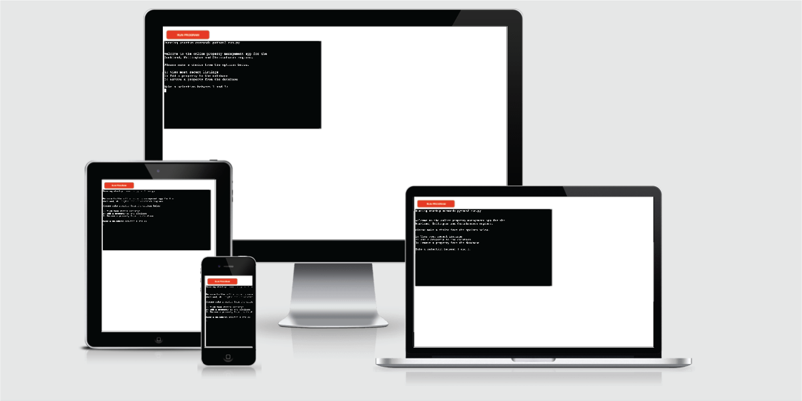
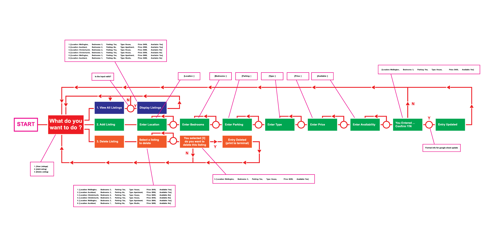
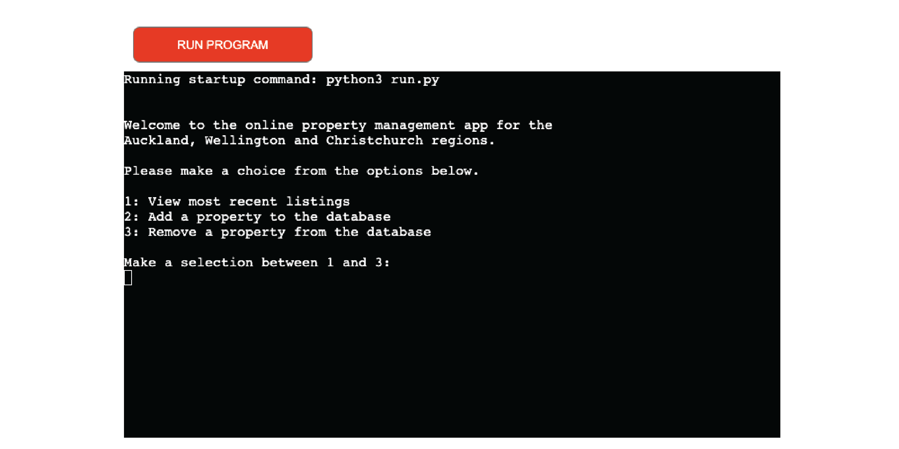
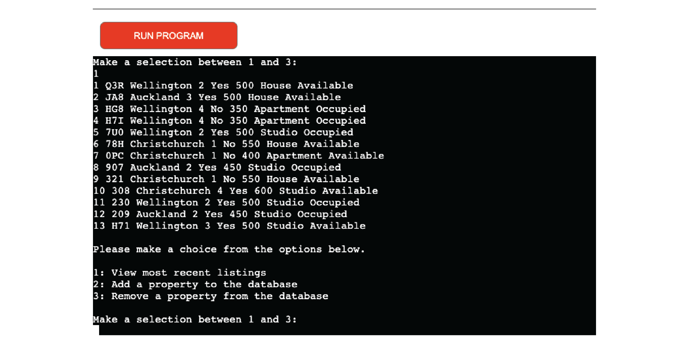
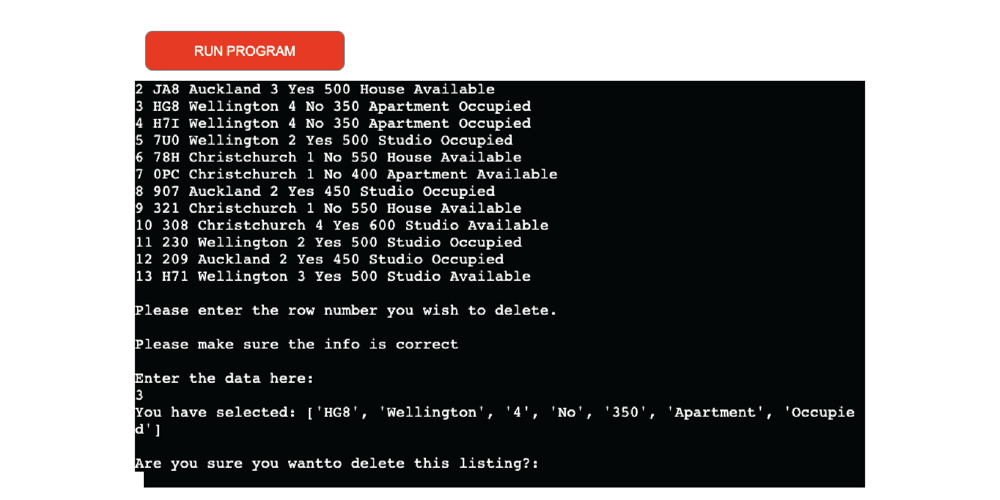
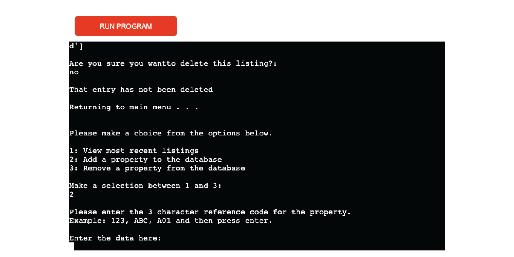
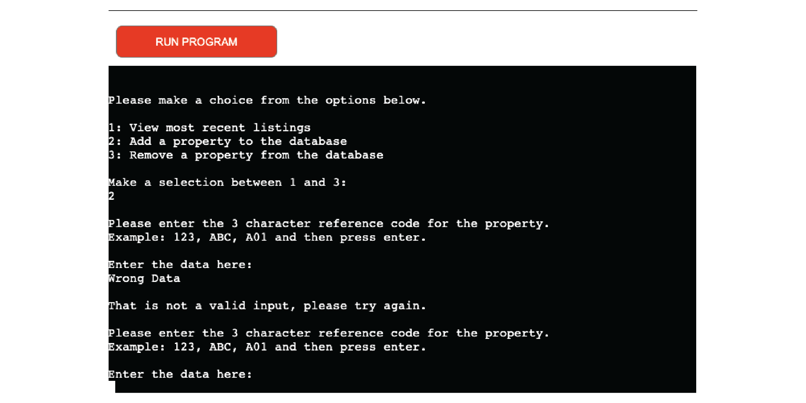

# Rental Management

## Purpose of the project

“Rental Management” is as the name implies a web app to allow a realter to manage their recent listings by easily viewing, adding to or deleting their listings. The app is designed to give the user the ability to create a simple small scale database that allows them to manage their listings more efficiently.
This is the live version of the app: https://rental-manage.herokuapp.com/

  

In order to use this app a user is 1st welcomed to the app and then displayed the main menu where the user can make a selection between 1 and 3.

- For a function to display all the listings
- For a function to add a new listing
- For a function to delete a current listing

  

# Features

## Existing Features

### Main Menu

- The main menu is the first screen the user is displayed with. It is a simple menu with 3 options to choose from.

  

### Display Listings

- When the user enter “1” from the main menu a list will display the current listings.

  

### Add a Listing

- The next entry on the main menu will allow the user to begin to enter data into the terminal and will have each input validated before continuing to enter the next set of information to the worksheet.

  

### Delete a Listing

- The last input selection allows the user to manually delete a listing based on the users input of the reference code.

  

## Features Left to Implement

- A new function to allow the user to modify an existing listing based on unque cell data.
- To allow the user to display a filtered list.
- A function to compare input values against existing values so that there is no duplication of the same data anywhere in the database.

# Testing

This web app was tested with the help of the following:

- PEP8 online checker and returned with no errors.

- Manually inputing invalid values in different stages in the project to see the results and making adjustments accordingly.

  

- I showed the application to a bunch of people and took there feedback and made changes where required.

# Bugs

## Solved Bugs

- In the delete listings function the user is required to select the row in which they want to remove. In displaying the values from google sheets the order of the listings did not correspond to the users input which results in the wrong listing being removed. I solved this by including a reverse syntax when the “get_all_values” element was called which displayed the correct number to the row in which the user wants to delete.

# Deployment

I used GitHub pages to deploy the project and the steps I done are as follows: 

The site was deployed to GitHub pages. The steps to deploy are as follows: 
  - Open GitHub project repository
  - Navigate to the Settings tab
  - Select pages from the menu on the left hand side
  - Within the source section I selected the Master Branch from the dop down menu.
  - This then provided me the link. 

Github Link: 
Heroku Link: https://rental-manage.herokuapp.com/

# Credits and Acknowledgements

- Code Institute: The "Love Sandwiches" project was the main source in order to import my API's to use in this project
- Stack Overflow: https://stackoverflow.com/ was one of my go to's when I had to do some basic research of a function/syntax.
- Geeks for Geeks: https://www.geeksforgeeks.org/ was the main site I used for all my general queries
- Code Institute Tutor Support was my last resort to get help with my code if I could not find an answer in any of the above sources.

I would like to thank my fellow students, the Code Institute and my mentor "Maria Hynes" and also "Sean" and "John" form Tutor Support for all the help and guidance to get this far.